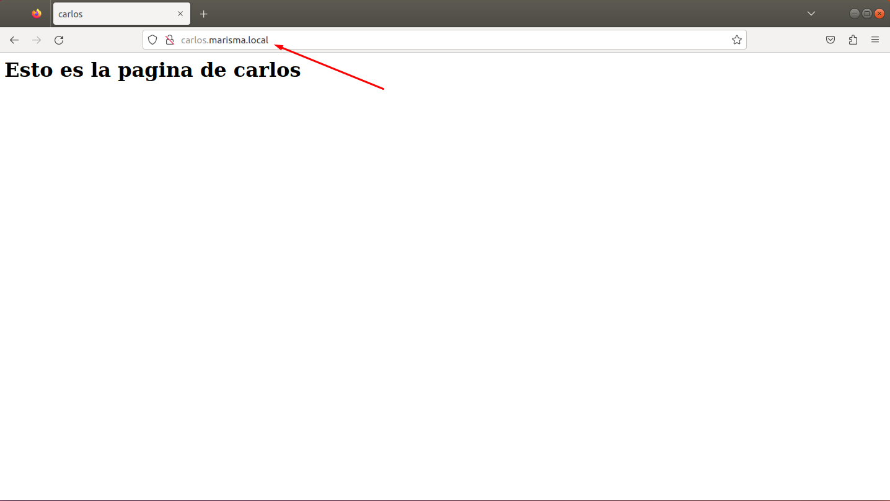
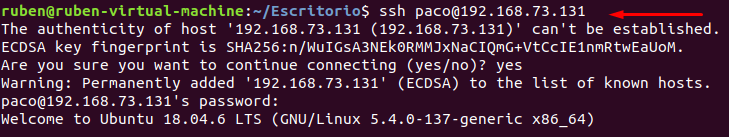
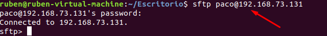
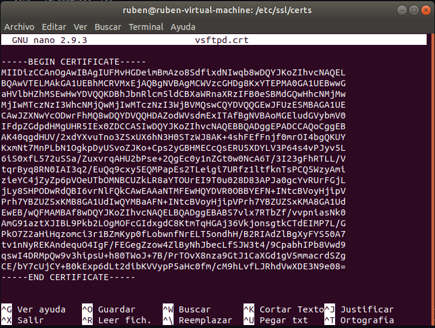
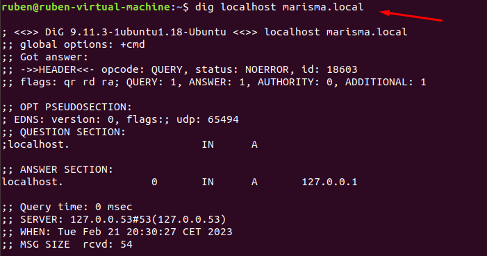
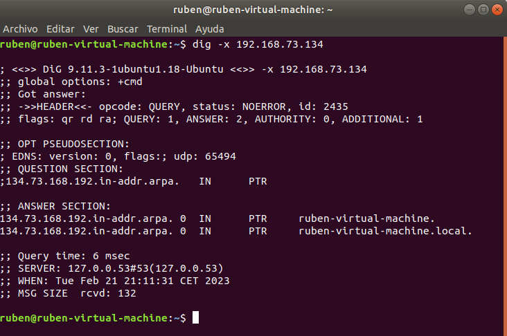
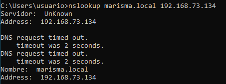
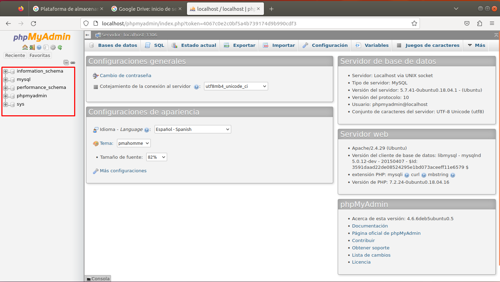
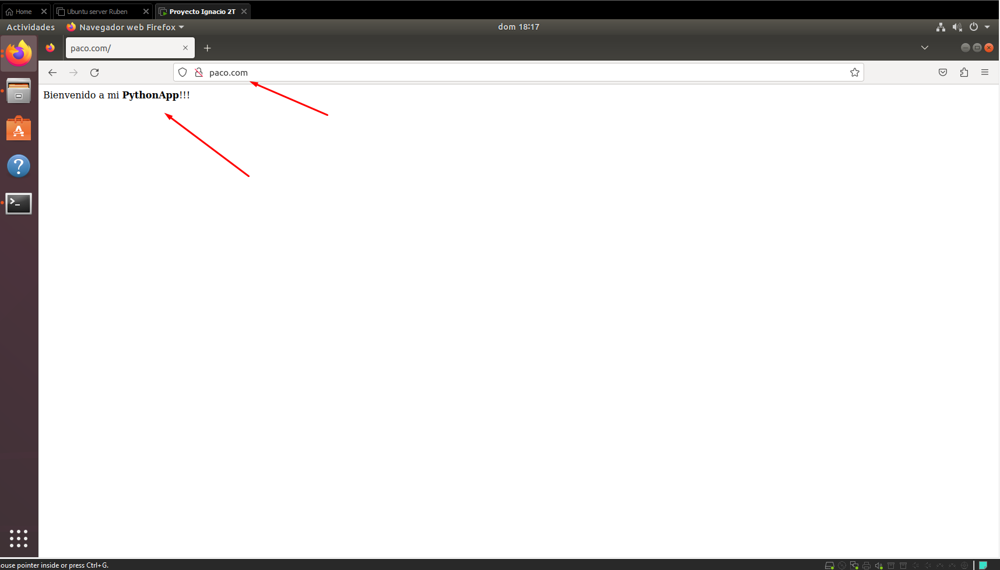

# PracticaSRI2

## Ejercicio 1 - Alojamiento a paginas web estaticas y dinamicas con php

- Comenzaremos instalando la pila LAMP en nuestro sistema con el comando. Para ello, comenzaremos actualizando los repositorios de linux con el siguiente comando:
```bash
sudo apt update
```
- Tras actualizar los repositorios, seguiremos por instalar apache
```bash
sudo apt install apache2
```
- Seguidamente, instalaremos MySQL
```bash
sudo apt install mysql-server
```
- Y por ultimo, instalaremos php
```bash
sudo apt install php libapache2-mod-php php-mysql
```
- Y ya tendriamos la pila LAMP instalada para dar alojamiento a las paginas web estaticas y dinamicas con php


## Ejercicio 2 - Creación de usuarios y del directorio correspondiente para el alojamiento web (script)

- Para crear un usuario en el sistema, deberemos escribir el siguiente comando:
```bash
sudo useradd <nombre_del_usuario_nuevo>
```
- Al crear el usuario, deberemos crearle su carpeta donde guardaremos su pagina personal para ese usuario y su index predeterminado
```bash
sudo mkdir -p /var/www/<usuario>/public_html
sudo touch /var/www/<usuario>/public_html/index.html
```
- Seguidamente, deberemos entrar en el archivo /var/www/<usuario>/public_html/index.html
```bash
sudo nano /var/www/<usuario>/public_html/index.html
```
- deberemos hacer una plantilla html en el archivo index.html
```html
<html>
  <head>
    <title> maria </title>
    <body>
      <h1> Esto es la pagina de maria </h1>
    </body>
  </head>
</html>
```
- Por ultimo, deberemos agregar una ip y un alias en el archivo hosts, para ello, deberemosirnos a /etc/hosts
```bash
sudo nano /etc/hosts
```
- Y deberemo agregar la ip del servidor (la que queramos en esa subred, y un alias)
```bash
<ip>      <alias>
```
### Script Usuarios

```bash
#!/bin/bash

echo "-------------------------------------"
echo "Proyecto Servicios de red de internet"
echo "-------------------------------------"
# Creacion de usuario por teclado
echo "Dime un nuevo usuario"
read usuario

while id $usuario &> /dev/null;
do
	echo "Este usuario ya existe en el sistema"
	echo "Escriba un usuario nuevo"
	read usuario
done
	useradd -d /home/$usuario -g 1000 -m -s /bin/bash $usuario
	passwd $usuario


#Creacion de host virtual por ese usuario creado
mkdir -p /var/www/$usuario/public_html
chown -R $USER:$USER /var/www/$usuario/public_html
chmod -R 755 /var/www
#Crear pagina de demostracion por cada host
touch /var/www/$usuario/public_html/index.html

#--------------------------------------------------------
#Plantilla HTML
echo "<html>" >> /var/www/$usuario/public_html/index.html
echo "<head>" >> /var/www/$usuario/public_html/index.html
echo "<title> $usuario </title>" >> /var/www/$usuario/public_html/index.html


echo "<body>" >> /var/www/$usuario/public_html/index.html
	echo "<h1> Esto es la pagina de $usuario </h1>" >> /var/www/$usuario/public_html/index.html
echo "</body>" >> /var/www/$usuario/public_html/index.html


echo "</head>" >> /var/www/$usuario/public_html/index.html
echo "</html>" >> /var/www/$usuario/public_html/index.html
#--------------------------------------------------------


echo "Creando usuario..."
sleep 3;
echo "**************"
echo "Usuario creado"
echo "**************"
```
### Script de eliminacion de usuario
	
```bash
#!/bin/bash


echo "Que usuario desea borrar?"

read usuario

while ! id $usuario &> /dev/null;
do
	echo "Este usuario no existe"
	echo "------------------------"
	echo "Escriba un usuario nuevo:"
	read usuario
done

userdel $usuario
rm -r /home/$usuario
rm -r /var/www/$usuario

echo "Eliminando usuario..."
sleep 3;


echo "*****************"
echo "Usuario eliminado"
echo "*****************"


```

## Ejercicio 3 - Host virtual en apache (script)
- Comenzaremos actualizando los repositorios
```bash
sudo apt update
```
- Despues, deberemos crear una carpeta een el directortorio /var/www/ donde gestionaremos las paginas y los host virtuales
```bash
sudo mkdir -p /var/www/carlos/public_html
```
- Ahora tenemos la estructura de directorio para nuestros archivos, pero son propiedad de nuestro usuario root. Si queremos que nuestro usuario regular pueda modificar archivos en nuestros directorios web, podemos cambiar la propiedad haciendo esto:
```bash
sudo chown -R $USER:$USER /var/www/carlos/public_html
```
- Tambien, deberemos permitir el acceso de lectura al directorio /var/www con el comando:
```bash
sudo chmod -R 755 /var/www
```
- Ahora, crearemos la pagina de inicio en la pagina que tenemos de prueeba:
```bash
nano /var/www/paco/public_html/index.html
```
- Entraremos al index.html con:
```bash
sudo nano index.html
```
- Y editaremos el fichero para crear una pagina web por defecto
```html
<html>
  <head>
    <title>paco</title>
  </head>
  <body>
    <h1>Esta es la pagina web de paco</h1>
  </body>
</html>
```
- Guardaremos eel archivo, y nos dirigiremos a la ruta /etc/apache/sites-available/
- Ahi, crearemos el archivo .conf y podemos hacerlo desde cero, o tambien podemos copiar el archivo 000-default.conf
```bash
sudo cp /etc/apache2/sites-available/000-default.conf /etc/apache2/sites-available/carlos.conf
```
- Ahora, editaremos el archivo con
```bash
sudo nano /etc/apache2/sites-available/carlos.conf
```
- Y escribiremos lo siguiente:
```bash
<VirtualHost *:80>
     ServerAdmin admin@carlos.marisma.local
     ServerName www.carlos.marisma.local
     ServerAlias carlos.marisma.local
     DocumentRoot /var/www/paco/public_html
     ErrorLog /error.log
     CustomLog /access.log combined
</VirtualHost>
```
- Seguidamente, deberemos habilitar nuestro sitio web
```bash
sudo a2ensite carlos.conf
```
- Tambien, deberemos deshabilitar el sitio web por defecto (000-default.conf)
```bash
sudo a2dissite 000-default.conf
```
- Tambien deberemos asignar una ip y un dominio a cada host que creemos en el archivo ubicado en /etc
```bash
sudo nano /etc/hosts
```
- Editaremos el archivo agregando una ip y un dominio a cadaa host que creemos
```bash
127.0.0.1   localhost
127.0.1.1   guest-desktop
your_server_IP carlos.marisma.local
```
- Por ultimo reiniciaremos apache para guardar/aplicar los cambios en el sistema
```bash
sudo service apache22 restart
```
- Y ya tendremos nuestro sitio web habilitado, el cual para probarlo, deberemos irnos al navegador y escribir:
```
http://carlos.com
```

### Resultado:
	
	
	
### Script automatico de creacion 

```bash
#!/bin/bash

read -p "Introduce el nombre de usuario: " usuario

# El archivo.conf
CONF="${usuario}.marisma.conf"

# El sites.avaliable
PATH_AVAILABLE="/etc/apache2/sites-available/${CONF}"

# El sites.enabled
PATH_ENABLED="/etc/apache2/sites-enabled/${CONF}"

# Subdominio
SUB_DOMAIN="${usuario}.marisma.local"

# La carpeta donde va la página web
DOCUMENT_ROOT="/var/www/$usuario"

# El índice
INDEX="${DOCUMENT_ROOT}/index.html"

touch $PATH_AVAILABLE

if [ -f $PATH_AVAILABLE ] ; then
   echo "Creando fichero de configuración"
   echo "<VirtualHost *:80>
           ServerAdmin admin@$SUB_DOMAIN
	   ServerName www.$SUB_DOMAIN
	   ServerAlias $SUB_DOMAIN
           DocumentRoot $DOCUMENT_ROOT/public_html
	   ErrorLog ${APACHE_LOG_DIR}/error.log
	   CustomLog ${APACHE_LOG_DIR}/access.log combined
    	  </VirtualHost>" >> $PATH_AVAILABLE

   a2ensite $CONF

   read -p "Introduce una dirección IP para el host: " ip
   read -p "Introduce el dominio que quieres asociarle que sea .marisma.local: " dominio

   echo "****************************************************"
   echo "Tu sitio web está alojado en http://$dominio.marisma.local"
   echo "****************************************************"

   service apache2 restart

   echo "$ip	$dominio.marisma.local" >> /etc/hosts
fi
```
	
### Script de eliminacion de virtual host
```bash
#!/bin/bash


echo "Que usuario desea borrar?"

read usuario


rm /etc/apache2/sites-available/$usuario.marisma.conf
rm /etc/apache2/sites-enabled/$usuario.marisma.conf


echo "Eliminando VirtualHost..."
sleep 2;


echo "*****************"
echo "Virtualhost eliminado"
echo "*****************"


```
	
	
## Ejercicio 4 - Creación de usuario del sistema para acceso a ftp, ssh, smtp (script)

- Para comenzar, deberemos instalar el servicio ssh
```bash
sudo apt install openssh-server
```
- Tras instalar el servicio, ya podremos utilizar el servicio ssh con los usuarios del sistema, pero antes deberemos irnos al archivo de configuracion del servicio de ssh
```bash
sudo nano /etc/ssh/sshd_config
```
	
- Al entrar deberemos descomentar la siguiente linea
```bash
port 22
```
- Y ya podremos utilizar ssh con los usuarios creados, lo cual necesitaremos el siguiente comando
	
```bash
ssh <usuario>@ip_que_utiliza
```
- Un dato a parte, es que al instalar el servicio ssh, ya con agregar un usuario al sistema, podremos acceder a su ssh/sftp completamente
### Resultado:
	


	
### Script de creacion de usuario con ssh/sftp
```bash
#!/bin/bash

echo "Dime un nuevo usuario"
read usuario

while id $usuario &> /dev/null;
do
  echo "Este usuario ya existe en el sistema"
  echo "Escriba un usuario nuevo"
  read usuario
done
useradd -d /home/$usuario -g 1000 -m -s /bin/bash $usuario
passwd $usuario

echo "*****************************"
echo "Usuario con SSH y SFTP creado"
echo "*****************************"
```
## Ejercicio 5 - Los clientes podrán acceder mediante ftp para la administración de archivos configurando adecuadamente TLS
- Para comenzar a utilizar la configuracion TLS para el cifrado de datos, comenzaremos instalando este servicio:
```bash
sudo apt instal vsftpd openssl
```
- Al tenerlo instalado, deberemos escribir el siguiente comando para genera el certificado de cifrado
```bash
sudo openssl req -x509 -nodes -days 365 -newkey rsa:2048 -keyout /etc/ssl/private/vsftpd.key -out /etc/ssl/certs/vsftpd.crt
```	
- Este comando generará un certificado de 1 año de duracion que generará una clave privada y un archivo certificado publico en los directotios `/etc/ssl/private` y `/etc/ssl/certs`
- Tras ejecutar el comando, nos aparecerán varios datos los cuales deberemos rellenar con informacion personal para la creacion del certificado
	
- Tras escribir esos datos, se generará el certificado, el cual podremos ver en el siguiente fichero
```bash
sudo nano /etc/ssl/certs/vsftpd.crt
```

- Seguidamente, deberemos irnos al srchivo de configuracion del vsftps
```bash
sudo nano /etc/vsftpd.conf
```
- Deberemos editar el archivo de texto y tendremos que escribir las siguientes lineas
```bash
ssl_enable=YES
allow_anon_ssl=NO
force_local_data_ssl=YES
force_local_logins_ssl=YES
ssl_tlsv1=YES
ssl_tlsv2=NO
ssl_tlsv3=NO
require_ssl_reuse=NO
```
- Guardaremos el archivo y reiniciaremos el servicio vsftpd
```bash
sudo service vsftpd restart
```
- Por ultimo, deberemos configurar el firewall para las conexiones FTP por TLS
```bash
sudo iptables -A INPUT -p tcp --dport 20 -j ACCEPT
sudo iptables -A INPUT -p tcp --dport 21 -j ACCEPT
sudo iptables -A INPUT -p tcp --dport 990 -j ACCEPT
```
- Y ya podremos utilizar el servicio SFTP y ssh por el certificado TLS encriptado
	
## Ejercicio 6 - Se creará un subdominio en el servidor DNS con las resolución directa e inversa (script)
- Comenzaremos instalando el servicio de bind en nuestra maquina
```bash
sudo apt install bind9 bind9utils bind9-doc
```

- Tras instalar el servicio, deberemos configurarlo a traves del archivo situado en /etc/bind/named.conf.options
```bash
sudo nano /etc/bind/named.conf.options
```

- Deberemos dejar el archivo de configuracion de la siguiente manera
```bash
options {

        directory "/var/cache/bind";
        recursion yes;
        #allow-transfer { none;  };
        allow-query { any; };
        dnssec-validation auto;
        dnssec-enable yes;

        auth-nxdomain no;    # conform to RFC1035
        listen-on-v6 { any; };

        forwarders {
                8.8.8.8;
                8.8.4.4;
        };
};

```

- Tras escribir el archivo, deberemos escribir el siguiente comando para ver que el archivo ha sido editado correctamente
```bash
sudo named-checkconf
```
- Si no aparece nada, será que tenemos el archivo configurado correctamente

- Ahora, procedemos a crear la zona directa en nuestro dominio, el cual, deberemos crear un fichero dentro de la ruta /etc/bind/ con el nombre del dominio que utilizaremos
```bash
cd sudo nano /etc/bind/<Dominio>
```
- Dentro de ese archivo deberemos escribir lo siguiente
```bash
/etc/bind/$TTL    604800
@       IN      SOA     ns.dominio. root.dominio. (
                          3         ; Serial
                     604800         ; Refresh
                      86400         ; Retry
                    2419200         ; Expire
                     604800 )       ; Negative Cache TTL
;
@       IN      NS      ns.dominio.
        IN      A       192.168.73.134
ns      IN      A       192.168.73.134
www     IN      A       192.168.73.134
```
- Despues, deberemos guardar el archivo, y crearemos la zona inversa tambien en la misma ruta (/etc/bind) llamandolo con el nombre ip menos el ultimo octeto
```bash
$TTL    604800
@       IN      SOA     ns.dominio. root.dominio. (
                          3         ; Serial
                     604800         ; Refresh
                      86400         ; Retry
                    2419200         ; Expire
                     604800 )       ; Negative Cache TTL
;
@         IN      NS      ns.dominio.
134       IN      PTR     ns.dominio.

```

- Seguidamente, comprobaremos que los archivos estan bien en cuanto a su sintaxis
```bash
Zona directa:
sudo named-checkzone zonadirecta /etc/bind/db.dominio

Zona inversa:
sudo named-checkzone ip_completa /etc/bind/zona_inversa
```

- Por ultimo, guardaremos el archivo, y le daremos los siguientes permisos
```bash
sudo chmod 640 /etc/bind/db.dominio
sudo chmod 640 /etc/bind/db.ip_menos_ultimo_octeto
```

- Ahora, reiniciaremos el servicio bind y comprobaremos que todo esta bien configurado
	
```bash
sudo service bind9 restart
```
	
- Ya tenemos todo configurado manualmente, ahora deberemos comprobar con los siguiente comandos:

```bash
En terminal de tu maquina por zona directa:
dig localhost dominio

En terminal de tu maquina por zona inversa:
dig -x ip_completa
	
En termina de OTRA maquina windows:
nslookup dominio ip_completa_de_maquina
```
	
### Resultado:
	
- Zona directa:
	

	
- Zona inversa:
	

	
- Comprobacion WIndows:
	



### Script de creacion automatica

```bash
#!/bin/bash

# Verificamos que se ejecute el script con permisos de root
if [ "$EUID" -ne 0 ]
  then echo "Por favor, ejecute como root"
  exit
fi

# Solicitar al usuario que ingrese el nombre de dominio
echo "Escribe el nombre del dominio:"
read dominio

# Solicitar al usuario que ingrese la dirección IP del servidor DNS
echo "Ingrese la dirección IP del servidor DNS:"
read ip_server

#Separa la ip del servidor
o1=$(echo $ip_server | cut -d. -f1)
o2=$(echo $ip_server | cut -d. -f2)
o3=$(echo $ip_server | cut -d. -f3)
o4=$(echo $ip_server | cut -d. -f4)

RUTA_ZONA_DIRECTA="/etc/bind/db.${dominio}"
RUTA_ZONA_INVERSA="/etc/bind/db.$o3.$o2.$o1.in-addr.arpa"

# Creamos el archivo de zona directa
echo "\$TTL    604800
@       IN      SOA     ns.${dominio}. root.${dominio}. (
                          3         ; Serial
                     604800         ; Refresh
                      86400         ; Retry
                    2419200         ; Expire
                     604800 )       ; Negative Cache TTL
;
@       IN      NS      ns.${dominio}.
ns      IN      A       ${ip_server}
www     IN      A       ${ip_server}
" > ${RUTA_ZONA_DIRECTA}

# Creamos el archivo de zona inversa
echo "\$TTL    604800
@       IN      SOA     ns.${dominio}. root.${dominio}. (
                          3         ; Serial
                     604800         ; Refresh
                      86400         ; Retry
                    2419200         ; Expire
                     604800 )       ; Negative Cache TTL
;
@	  IN	  NS	  ns1.$dominio.
$o4       IN      PTR     ns.${dominio}.
" > ${RUTA_ZONA_INVERSA}

# Añade las zonas a los archivos de configuración.
echo "include "/etc/bind/named.conf.options";
include "/etc/bind/named.conf.local";
include "/etc/bind/named.conf.default-zones";

zone "${dominio}" {
        type master;
        file "${RUTA_ZONA_DIRECTA}";
};

zone "$o3.$o2.$o1.in-addr.arpa" {
        type master;
        file "${RUTA_ZONA_INVERSA}";
};

" > /etc/bind/named.conf

# Le damos permisos a los archivos de zona creados
chmod 640 ${RUTA_ZONA_DIRECTA}
chmod 640 ${RUTA_ZONA_INVERSA}

# Reiniciamos el servicio de Bind9
systemctl restart bind9

echo "***************************"
echo "Subdominio creado con éxito"
echo "***************************"
```
### Script de eliminacion de dominio
```bash
#!/bin/bash

# Verificamos que se ejecute el script con permisos de root
if [ "$EUID" -ne 0 ]
  then echo "Por favor, ejecute como root"
  exit
fi

# Solicitar al usuario que ingrese el nombre de dominio
echo "Que dominio quieres eliminar:"
read dominio

# Solicitar al usuario que ingrese la dirección IP del servidor DNS
echo "Ingrese la dirección IP que quieres eliminar:"
read ip_server

o1=$(echo $ip_server | cut -d. -f1)
o2=$(echo $ip_server | cut -d. -f2)
o3=$(echo $ip_server | cut -d. -f3)
o4=$(echo $ip_server | cut -d. -f4)


rm /etc/bind/db.$dominio
rm /etc/bind/$o3.$o2.$o1.in-addr.arpa

echo "***************************"
echo "DNS eliminado correctamente"
echo "***************************"


```


## Ejercicio 7 - Se creará una base de datos además de un usuario con todos los permisos sobre dicha base de datos (ALL PRIVILEGES) (script)
- Teniendo el servicio mysql instalado, deberemos ingresar a mysql a traves del terminal
```bash
sudo mysql
```
- Escribiremos la contraseña de usuario root y desde ahi, podremos observar y administrar nuestras bases de datos con los siguientes comandos:

Ver bases de datos
```mysql
show databases;
``` 
Ver usuarios de phpmyadmin
```mysql
select user from mysql.user;
```
- Seguidamente, para darle privilegios sobre esa base de datos, deberemos escribir el siguiente comando (como root)
```mysql
GRANT ALL PRIVILEGES ON <base_de_datos>.* TO '<usuario>'@'localhost' IDENTIFIED BY '<contraseña>';"
```
Por ultimo, para ver los privilegios que le hemos dado a los usuarios, deberemos escribir el siguiente comando:
```mysql
show grants for '<usuario>'@'localhost';
```
- Y ya podremos agregar el usuario y base de datos correctamente en nuestro sistema

### Script de privilegios y usuarios automaticos en base de datos

```bash
#!/bin/bash

read -p "Introduce el nombre de usuario:" db_user

mysql -u root -p -e "CREATE DATABASE ${db_user};"

mysql -u root -p -e "GRANT ALL PRIVILEGES ON ${db_user}.* TO '${db_user}'@'localhost' IDENTIFIED BY 'password';"

echo "*********************************************"
echo "Base de datos y usuario creados correctamente"
echo "*********************************************"
```
- Tambien deberemos utilizar phpmyadmin, con lo que lo instalaremos con:
```bash
sudo apt install phpmyadmin
```
- A parte, podremos acceder a phpmyadmin desde el navegador escribiendo:
```
localhost/phpmyadmin
```
- Podremos acceder al gestor de bases de datos, donde para iniciar sesion, deberemos escribir
```
usuario: phpmyadmin
contraseña:<contraseña_de_root>
```	
- Escribiremos los credenciales y ya ingresaremos a phpmyadmin pero no podremos visualizar todas las bases de datos
- Para ello, deberemos ingresar en mysql
```bash
sudo mysql
contraseña:
```
- Ejecutaremos la siguiente sentencia
```mysql
grant all privileges on *.* to 'phpmyadmin'@'localhost' identified by '<contraseña_usuario>';
```
- Y ya podremos acceder a phpmyadmin viendo tas las bases de datos del sistema
	
### Resultado
	

	
## Ejercicio 8 - Se habilitará la ejecución de aplicaciones Python con el servidor web 
	
- Para habilitar la ejecucion de aplicacion Python en el servidor web, deberemos instalar el servicio wsgi
```bash
sudo apt-get install libapache2-mod-wsgi
```
- Al tenerlo instalado, vamos crear una pagina para probar que funcione correctamente
- Para ello, crearemos un usuario nuevo y nos iremos a su carpeta de /var/www/
```
cd /var/www/<usuario_nuevo>/
sudo mkdir mypythonapp
sudo mkdir public_html
```
- Entraremos en la carpeta "mypythonapp" y crearemos la aplicacion python
```
cd /var/www/<usuario>/mypythonapp
sudo nano controller.py
```
- En la cual, deberemos escribir la aplicacion que deseemos, pero en mi caso escribiré esto a modo de prueba
```html
# -*- conding: utf-8 -*-

def application(environ, start_response):
    # Genero la salida HTML a mostrar al usuario
    output = "<p>Bienvenido a mi <b>PythonApp</b>!!!</p>"
    # Inicio una respuesta al navegador
    start_response('200 OK', [('Content-Type', 'text/html; charset=utf-8')])
    # Retorno el contenido HTML
    return output
```
- Ahora, nos iremos a la carpeta del virtual host y abriremos la carpeta del usuario_creado.conf (si no existe, deberemos crearla)
```bash
cd /etc/apache2/sites-available
sudo nano usuario.conf
```
- Y deberemos escribir o agregar lo siguiente
```bash
<VirtualHost *:80>
    ServerName usuario.com

    DocumentRoot /var/www/usuario/public_html
    WSGIScriptAlias / /var/www/usuario/mypythonapp/controller.py

</VirtualHost>
```
- Ahora, deberemos habilitar el virtual host
```bash
sudo a2ensite usuario.conf
Site usuario.com already enabled
```
- Un dato a parte, es que necesitamos que en el archivo host, esté incluida una ip y un alias para referirnos a la pagina

- Por ultimo, lo que deberemos hacer es, reiniciar el servicio de apache
```
sudo service apache2 restart
```
- Y ya podremos visualizar la pagina al referirnos por el siguiente enlace:
```
http://paco.marisma.local
```
### Resultado


	
- Script de habilitacion de mod WSGI
```bash
#!/bin/bash


a2enmod wsgi
echo "*******************************************"
echo "Complemento python habilitado correctamente"
echo "*******************************************"
```
